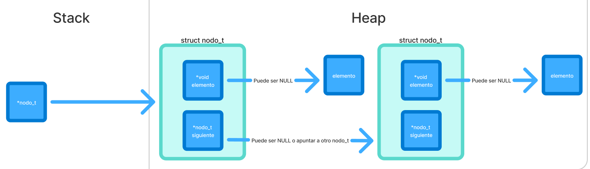
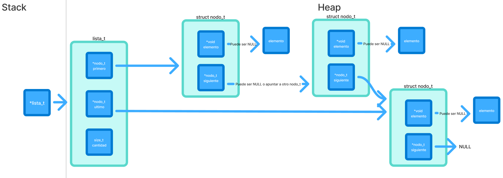
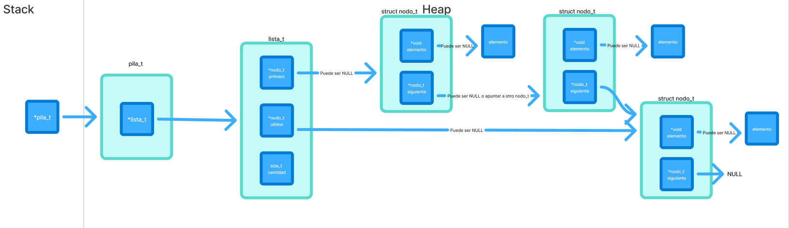
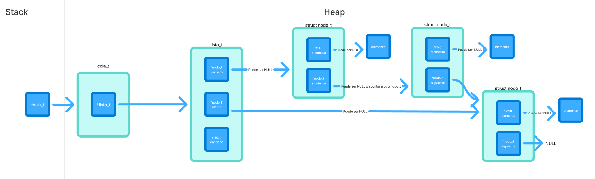

<div align="right">

</div>

# TDA LISTA/PILA/COLA

## Repositorio de Luca Frisoni - 113497 - lfrisoni@fi.uba.ar / frisoniluca1@gmail.com(Github)

- Para compilar:

```bash
make compilar
```

- Para ejecutar:

```bash
./programa
```

- Para ejecutar con valgrind:

```bash
make valgrind
```

---

## 🛠️Funcionamiento

### 🏛️Estructuras

Para este trabajo práctico se definieron distintas estructuras de datos que permiten organizar y manipular los elementos de forma eficiente.  
A continuación se detallan las estructuras principales:

---

#### 🔹`nodo_t`

Representa un **nodo** de la lista enlazada.

- Contiene un puntero genérico al dato almacenado.
- Guarda un puntero al siguiente nodo en la lista.

📊 **Diagrama de memoria:**  


---

#### 🔹`lista_t`

Representa la **lista enlazada**.

- Tiene un puntero al primer nodo de la lista.
- Mantiene un puntero al último nodo, para inserciones rápidas al final.
- Lleva un contador con la cantidad total de elementos.

📊 **Diagrama de memoria:**  


---

#### 🔹`pila_t`

Representa una **pila** (estructura LIFO).

- Internamente utiliza una lista para administrar los elementos.
- Los elementos se apilan y desapilan siempre desde un mismo extremo.

📊 **Diagrama de memoria:**  


---

#### 🔹`cola_t`

Representa una **cola** (estructura FIFO).

- Internamente también se implementa mediante una lista.
- Los elementos se encolan al final y se desencolan desde el principio.

📊 **Diagrama de memoria:**  


---

### ⚙️Funcionamiento General

---

### 1. Validación de parámetros

Antes de iniciar cualquier procesamiento, el programa valida que los parámetros de entrada sean correctos con `validando_params(argc, argv)`:

- 🔹 Cantidad de argumentos: deben ser **exactamente 5** (`<ejecutable> <archivo.csv> buscar nombre|id <valor>`).
- 🔹 Formato del archivo: se comprueba que el archivo pasado como `argv[1]` tenga la extensión **.csv** con `validando_formato_csv()`.
- 🔹 Comando de operación: el argumento `argv[2]` debe ser **'buscar'**.
- 🔹 Tipo de búsqueda: el argumento `argv[3]` debe ser **"nombre"** o **"id"**.

---

### 2.Flujo de Ejecución

---

### 2.1 Lectura principal (según `argv[1]`)

Se realiza la lectura de un archivo **.csv** cuya ubicacion fue pasado por parametro con `tp1_leer_archivo()`.

```c
tp1_t *tp1_leer_archivo(const char *nombre);
```

**📌Esta funcion se encarga de:**

- 🔹 Manejar la apertura del archivo **.csv**📑 con `manejador_de_archivos_open()`
- 🔹 Crear la estructura **tp1_t**.
- 🔹 Leer y validar todas las lineas del archivo (se lee dinamicamente) con `leer_linea()`.
- 🔹 Transforma la linea de texto en un tipo pokemon **struct pokemon** si es valido con `parsear_pokemon()` y demas funciones internas.
- 🔹 Agregar el pokemon parseado a la estructrua **tp1_t** con `agregar_pokemon()`.
- 🔹 Ordenar ascendemente los pokemones por id una vez finalizada la lectura completa del archivo con `bubbleSort_pokemones_id_asc_optimizado()`.
- 🔹 Correcta liberacion de memoria y cierre de archivos.
- 🔹 Retorno de la estructura con los pokemones y su cantidad.

- ⚠️ En caso de que el archivo no respete el formato, no se pueda abrir o falle la reserva de memoria, la función devuelve `NULL`.

---

### 2.2 Selección de operación (según `argv[2]`)

El sistema permite al usuario hacer una busqueda entre 2 operaciones predefinidas.

#### 🔍 buscar

**Parámetros:** `<tipo_busqueda> <valor>`

- 🔹Permite buscar un Pokémon en el archivo:
  - `nombre`: busca por nombre con `tp1_buscar_nombre()`.
  - `id`: busca por ID con `tp1_buscar_id()`.
- 🔹Si lo encuentra, se muestra con `mostrar_pokemon()`.
- 🔹Si no existe, devuelve **NULL** e imprime que no fue encontrado
  Explicación de cómo funcionan las estructuras desarrolladas en el TP y el funcionamiento general del mismo.

---

### 3. Liberación de Memoria

Al finalizar la ejecución:

- 🗑️Se destruye la lista de Pokémones con `lista_destruir(lista_pokemones)`.

- 🗑️Se libera la estructura principal del TP con `tp1_destruir(tp1)`.

Esto asegura que no queden memory leaks ni recursos sin liberar.

---

## Tests Unitarios

Esta sección describe cómo se verifican todas las funciones primitivas del proyecto mediante pruebas unitarias y de estrés.

### Objetivo

- 🔹Comprobar que cada función del proyecto se ejecute correctamente en distintos escenarios.
- 🔹Asegurar que las operaciones sobre las estructuras dinámicas se realicen sin errores de memoria.
- 🔹Validar el correcto funcionamiento de cada una de las Estructura de Datos.
- 🔹Confirmar que las funciones devuelvan los resultados esperados.
- 🔹Asegurarse el buen funcionamiento en casos demandantes

### Cobertura de pruebas

Se realizan **171 pruebas unitarias** que incluyen:

- 🔹**Pruebas de creacion**
- 🔹**Pruebas de incercion**
- 🔹**Pruebas de eliminacion**
- 🔹**Pruebas de busqueda**
- 🔹**Pruebas de liberacion de memoria**
- 🔹**Pruebas de iteracion**
- 🔹**Pruebas de combinacion de funciones**
- 🔹**Pruebas de estres**

### Compilación y ejecución de tests

Para compilar los tests:

```bash
make compilar_t_lista
make compilar_t_cola
make compilar_t_pila
```

Para ejecutar los tests:

```bash
./tests_lista
./tests_cola
./tests_pila
```

Para ejecutar con valgrind:

```bash
make valgrind_t_lista
make valgrind_t_cola
make valgrind_t_pila
```

## 📚 Respuestas a las preguntas teóricas

### 1. Explicar qué es una lista, lista enlazada y lista doblemente enlazada.

Una **lista** es una estructura de datos lineal que permite almacenar elementos en un orden secuencial. Los elementos pueden repetirse, y se puede insertar o eliminar en cualquir posicion.

La _lista enlazada_ es una implementacion de la lista donde cada elemento esta en un **nodo**, y cada nodo guarda:

- 📌El dato
- 🔗Un puntero al siguiente nodo

A cambio en la _lista doblemente enlazada_ cada nodo guarda:

- 📌El dato
- 🔗Un puntero al siguiente nodo
- 🔙Un puntero al nodo anterior
  Permitiendo recorrer la lista en ambos sentidos facilitando inserciones/eliminaciones en posiciones intermedias, a costa de mayor uso de memoria.

### 2. Explicar qué es una lista circular y de qué maneras se puede implementar.

Una _lista circular_ es una variante de la lista enlazada en la que el ultimo nodo apunta nuevamente al primer nodo, formando un 'ciclo'

**Maneras de implementarla**:

- 🔁**Simplemente enlazada circular:** cada nodo apunta al siguiente, y el último apunta al primero.

- 🔁**Doblemente enlazada circular:** cada nodo apunta tanto al siguiente como al anterior, y el primero y el último se conectan entre sí en ambos sentidos.

### 3. Explicar la diferencia de funcionamiento entre cola y pila.

La **pila** funciona con el principio LIFO(Last In, First Out): el último elemento en entrar es el primero en salir.

Operaciones principales:

- 🆙apilar (push) → mete un elemento arriba de la pila.

- ⬇️desapilar (pop) → saca el último elemento agregado.

A diferenica, la **cola** funciona on el principio FIFO (First In, First Out): el primero en entrar es el primero en salir.

Operaciones principales:

- ➕encolar (enqueue) → agrega un elemento al final de la cola.

- ➖desencolar (dequeue) → saca el primer elemento agregado.

### 4. Explicar la diferencia entre un iterador interno y uno externo.

**Iterador interno:**

- 🔹Es una función que recibe otra función (callback) y la aplica a cada elemento de la lista.
  Cuando la funcion retorna false se deja de recorrer.

- ⏳El control del recorrido lo tiene la estructura de datos.

_Ejemplo_: lista_con_cada_elemento(lista, funcion, extra).

✔️ Es más simple de usar, pero menos flexible

**Iterador externo:**

- 🔹Es una estructura independiente que te permite recorrer la lista paso a paso.

- 👤 El control del recorrido lo tiene el usuario.

Funciones típicas:

- `iterador_crear()`

- `iterador_hay_mas()`

- `iterador_siguiente()`

- `iterador_obtener_actual()`

- `iterador_destruir()`

✔️ Es más flexible porque podés decidir hasta dónde recorrer, hacer varias pasadas, combinar con condiciones, etc.

### 5. Complejidad computacional de las funciones (`lista_pila_cola.c`)

- **`lista_crear`** → O(1)
  La función ejecuta una cantidad constante de pasos: reserva memoria para la estructura principal y realiza verificaciones simples.
  Por lo tanto, la complejidad es O(1) en todos los casos.

- **`lista_vacia`** → O(1)
  La función realiza comparaciones entre punteros para determinar si la lista está vacía, sin recorrer los elementos.
  Por lo tanto, la complejidad es O(1) en todos los casos.

- **`lista_cantidad`** → O(1)
  La función accede directamente al campo cantidad de la estructura, sin realizar recorridos ni operaciones adicionales.
  Por lo tanto, la complejidad es O(1) en todos los casos.

- **`lista_agregar`** → O(1)
  La función crea un nuevo nodo y lo agrega al final de la lista utilizando el puntero ultimo, evitando recorrer los nodos.
  Todas las operaciones que realiza son de costo constante.
  Por lo tanto, la complejidad es O(1) en todos los casos.

- **`lista_insertar`** → O(n)
  La función recorre la lista hasta la posición indicada para insertar el nuevo nodo, realizando operaciones de costo constante en cada paso.
  Si la posición es 0, la inserción se realiza en tiempo constante; pero en el peor caso (posición final), se recorren todos los nodos.
  Por lo tanto, la complejidad es O(n), donde n depende de la posición de inserción.

- **`lista_eliminar_elemento`** → O(n)
  La función recorre la lista hasta la posición indicada para eliminar el nodo correspondiente.
  Si se elimina el primer elemento, el costo es constante, pero en el peor caso debe recorrer toda la lista.
  Por lo tanto, la complejidad es O(n), donde n depende de la posición del elemento eliminado.

- **`lista_buscar_posicion`** → O(n)
  La función recorre la lista nodo a nodo comparando los elementos mediante la función comparador.
  En el mejor caso el elemento está al principio, pero en el peor caso debe recorrer toda la lista.
  Por lo tanto, la complejidad es O(n), donde n es la cantidad de elementos.

- **`lista_buscar_elemento`** → O(n)
  La función recorre la lista desde el primer nodo hasta alcanzar la posición indicada, realizando operaciones de costo constante en cada paso.
  Por lo tanto, la complejidad es O(n), donde n depende de la posición solicitada.

- **`lista_con_cada_elemento`** → O(n)
  La función aplica una función callback a cada elemento de la lista y avanza nodo por nodo hasta el final o hasta que el callback indique detenerse.
  Cada iteración tiene costo constante.
  Por lo tanto, la complejidad es O(n), donde n es la cantidad de elementos procesados.

- **`lista_destruir_todo`** → O(n)
  La función recorre toda la lista liberando cada nodo y ejecutando, si corresponde, la función destructora para cada elemento.
  Cada operación de liberación tiene costo constante, pero se repite para todos los nodos.
  Por lo tanto, la complejidad es O(n), donde n es la cantidad de elementos.

- **`lista_destruir`** → O(n)
  La función invoca a `lista_destruir_todo`, recorriendo y liberando todos los nodos de la lista.
  En caso de que la lista esté vacía, el costo es constante, ya que solo se libera la estructura principal sin recorrer nodos.
  Por lo tanto, la complejidad es O(n), donde n es la cantidad de elementos.

- **`lista_iterador_crear`** → O(1)
  La función ejecuta una cantidad constante de pasos, independientemente del tamaño de la lista o de los datos.
  Por lo tanto, la complejidad es O(1) en todos los casos.

- **`lista_iterador_hay_mas_elementos`** → O(1)
  La función realiza solo una verificación booleana sin recorrer la lista.
  Por lo tanto, la complejidad es O(1) en todos los casos.

- **`lista_iterador_siguiente`** → O(1)
  La función avanza el puntero al siguiente nodo una única vez.
  Por lo tanto, la complejidad es O(1) en todos los casos.

- **`lista_iterador_obtener_actual`** → O(1)
  La función accede directamente al elemento actual sin recorrer la lista.
  Por lo tanto, la complejidad es O(1) en todos los casos.

- **`lista_iterador_destruir`** → O(1)
  La función libera la memoria ocupada por el iterador.
  Por lo tanto, la complejidad es O(1) en todos los casos.

- **`pila_crear`** → O(1)
  La función ejecuta una cantidad constante de pasos: crea una lista interna, reserva memoria para la estructura principal y realiza verificaciones simples.
  Por lo tanto, la complejidad es O(1) en todos los casos.

- **`pila_apilar`** → O(1)
  La función inserta un nuevo elemento al inicio o al final de la lista interna, según si está vacía o no.
  Ambas operaciones (`lista_agregar` y `lista_insertar` en la posición 0) son de costo constante.
  Por lo tanto, la complejidad es O(1) en todos los casos.

- **`pila_desapilar`** → O(1)
  La función elimina el primer elemento de la lista interna mediante `lista_eliminar_elemento` con posición 0, operación de costo constante.
  Por lo tanto, la complejidad es O(1) en todos los casos.

- **`pila_ver_primero`** → O(1)
  La función accede directamente al primer nodo de la lista interna sin realizar recorridos ni operaciones adicionales.
  Por lo tanto, la complejidad es O(1) en todos los casos.

- **`pila_cantidad`** → O(1)
  La función devuelve la cantidad de elementos de la lista interna accediendo directamente a un campo de la estructura.
  Por lo tanto, la complejidad es O(1) en todos los casos.

- **`pila_destruir`** → O(n)
  La función invoca a `lista_destruir`, que recorre y libera todos los nodos de la lista interna, y luego libera la estructura principal de la pila.
  En caso de que la pila esté vacía, el costo es constante, ya que solo se libera la estructura sin recorrer nodos.
  Por lo tanto, la complejidad es O(n), donde n es la cantidad de elementos almacenados en la pila.

- **`cola_crear`** → O(1)
  La función ejecuta una cantidad constante de pasos: crea una lista interna, reserva memoria para la estructura principal y realiza verificaciones simples.
  Por lo tanto, la complejidad es O(1) en todos los casos.

- **`cola_encolar`** → O(1)
  La función agrega un nuevo elemento al final de la lista interna utilizando `lista_agregar`, que opera en tiempo constante gracias al mantenimiento del puntero al último nodo.
  Por lo tanto, la complejidad es O(1) en todos los casos.

- **`cola_desencolar`** → O(1)
  La función elimina el primer elemento de la lista interna mediante `lista_eliminar_elemento` con posición 0, operación de costo constante.
  Por lo tanto, la complejidad es O(1) en todos los casos.

- **`cola_ver_primero`** → O(1)
  La función accede directamente al primer nodo de la lista interna sin realizar recorridos ni operaciones adicionales.
  Por lo tanto, la complejidad es O(1) en todos los casos.

- **`cola_cantidad`** → O(1)
  La función devuelve la cantidad de elementos almacenados accediendo directamente al campo cantidad de la lista interna.
  Por lo tanto, la complejidad es O(1) en todos los casos.

- **`cola_destruir`** → O(n)
  La función invoca a `lista_destruir`, que recorre y libera todos los nodos de la lista interna, y luego libera la estructura principal de la cola.
  En caso de que la cola esté vacía, el costo es constante, ya que solo se libera la estructura sin recorrer nodos.
  Por lo tanto, la complejidad es O(n), donde n es la cantidad de elementos almacenados en la cola.
